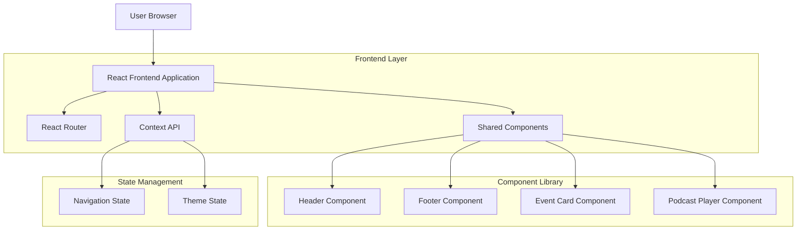
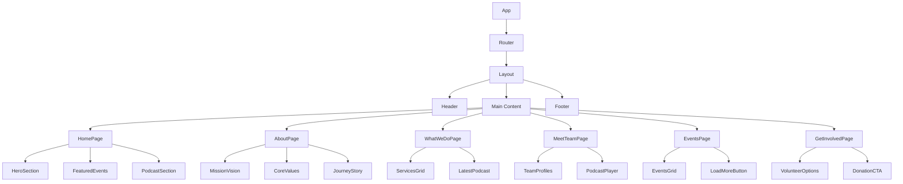

## 1. Architecture Design



## 2. Technology Description

* **Frontend**: React\@18 + TailwindCSS\@3 + Vite

* **Initialization Tool**: vite-init

* **Routing**: React Router DOM\@6

* **State Management**: React Context API + useReducer

* **Styling**: TailwindCSS with custom configuration

* **Icons**: Material Symbols Outlined

* **Build Tool**: Vite for fast development and optimized builds

* **Backend**: None (Static content with potential future CMS integration)

## 3. Route Definitions

| Route          | Purpose                                                 | Component       |
| -------------- | ------------------------------------------------------- | --------------- |
| /              | Homepage with hero, featured events, and latest podcast | HomePage        |
| /about         | Organization story, mission, vision, and core values    | AboutPage       |
| /what-we-do    | Services overview and latest podcast                    | WhatWeDoPage    |
| /meet-the-team | Team member profiles with podcast player                | MeetTeamPage    |
| /events        | Upcoming events grid with sign-up functionality         | EventsPage      |
| /get-involved  | Volunteer opportunities and donation options            | GetInvolvedPage |

## 4. Component Architecture

### 4.1 Core Components

**Layout Components:**

```typescript
interface LayoutProps {
  children: React.ReactNode;
  className?: string;
}

interface HeaderProps {
  currentPage: string;
  onNavigate: (path: string) => void;
}

interface FooterProps {
  socialLinks: SocialLink[];
}
```

**Content Components:**

```typescript
interface EventCardProps {
  title: string;
  date: string;
  location: string;
  description: string;
  imageUrl: string;
  onSignUp: () => void;
}

interface TeamMemberProps {
  name: string;
  role: string;
  bio: string;
  imageUrl: string;
}

interface PodcastPlayerProps {
  episodeTitle: string;
  embedUrl: string;
  publishedDate: string;
}
```

### 4.2 Page Components Structure

**HomePage Component:**

```typescript
interface HomePageProps {
  featuredEvents: Event[];
  latestPodcast: PodcastEpisode;
}
```

**EventsPage Component:**

```typescript
interface EventsPageProps {
  events: Event[];
  onLoadMore: () => void;
  hasMore: boolean;
}
```

## 5. State Management

### 5.1 Navigation Context

```typescript
interface NavigationState {
  currentPath: string;
  previousPath: string;
  navigationHistory: string[];
}

interface NavigationContextType {
  state: NavigationState;
  navigate: (path: string) => void;
  goBack: () => void;
}
```

### 5.2 Theme Context

```typescript
interface ThemeState {
  isDarkMode: boolean;
  toggleTheme: () => void;
}
```

## 6. Data Models

### 6.1 Event Model

```typescript
interface Event {
  id: string;
  title: string;
  description: string;
  date: string;
  location: string;
  imageUrl: string;
  difficulty: 'Beginner' | 'Intermediate' | 'Advanced';
  maxParticipants: number;
  currentParticipants: number;
  registrationOpen: boolean;
}
```

### 6.2 Team Member Model

```typescript
interface TeamMember {
  id: string;
  name: string;
  role: string;
  bio: string;
  imageUrl: string;
  socialLinks?: SocialLink[];
}
```

### 6.3 Podcast Episode Model

```typescript
interface PodcastEpisode {
  id: string;
  title: string;
  description: string;
  embedUrl: string;
  publishedDate: string;
  duration: string;
  thumbnailUrl: string;
}
```

## 7. Component Hierarchy



## 8. Styling Architecture

### 8.1 Tailwind Configuration

```javascript
// tailwind.config.js
module.exports = {
  darkMode: "class",
  theme: {
    extend: {
      colors: {
        primary: "#13ec6d",
        "background-light": "#f6f8f7",
        "background-dark": "#102218",
      },
      fontFamily: {
        display: ["Plus Jakarta Sans", "sans-serif"]
      },
      borderRadius: {
        DEFAULT: "0.25rem",
        lg: "0.5rem",
        xl: "0.75rem",
        full: "9999px"
      }
    }
  }
}
```

### 8.2 Component Styling Patterns

* Consistent spacing using Tailwind utilities

* Responsive design with breakpoint prefixes

* Dark mode support with conditional classes

* Hover and focus states for interactive elements

* Custom animations for smooth transitions

## 9. Performance Optimization

### 9.1 Code Splitting

* Route-based code splitting with React.lazy()

* Component-level splitting for heavy components

* Image optimization with proper loading strategies

### 9.2 Caching Strategy

* Browser caching for static assets

* Component state persistence where appropriate

* Image lazy loading for better initial load times

### 9.3 Bundle Optimization

* Tree shaking for unused code elimination

* Minification for production builds

* Asset compression and optimization

