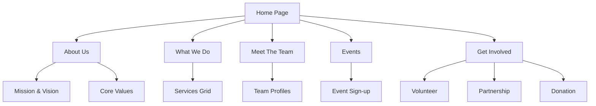

## 1. Product Overview
Transform six standalone HTML pages into a unified, modern web application with seamless navigation, shared components, and enhanced user experience while preserving existing content and visual design.

This integration creates a cohesive platform for Darren's Adventures outdoor community organization, enabling users to explore events, learn about the team, discover what they do, and get involved through a single, synchronized application.

## 2. Core Features

### 2.1 User Roles
| Role | Registration Method | Core Permissions |
|------|---------------------|------------------|
| Visitor | No registration required | Browse all content, view events, listen to podcasts |
| Community Member | Email registration | Sign up for events, receive newsletters, participate in discussions |
| Event Host | Application approval | Create and manage community events |

### 2.2 Feature Module
Our web application consists of the following integrated pages:

1. **Home Page**: Hero section with call-to-action, featured events grid, latest podcast embed, community introduction
2. **About Us Page**: Organization story, mission & vision statements, core values showcase, team introduction
3. **What We Do Page**: Services overview (guided hikes, workshops, clean-ups), latest podcast section, service details
4. **Meet The Team Page**: Team member profiles with photos, roles, and descriptions, podcast player integration
5. **Events Page**: Upcoming events grid with sign-up functionality, event filtering, load more capability
6. **Get Involved Page**: Volunteer opportunities, partnership programs, event hosting information, donation calls-to-action

### 2.3 Page Details
| Page Name | Module Name | Feature description |
|-----------|-------------|---------------------|
| Home | Hero Section | Display full-width hero with mountain imagery, adventure tagline, and primary CTA button |
| Home | Featured Events | Showcase 3 upcoming events with images, dates, descriptions in responsive grid |
| Home | Latest Podcast | Embed YouTube player with episode information and view all episodes link |
| Home | Community Intro | Text section explaining organization's mission and community focus |
| About | Journey Story | Narrative section describing organization's origins and purpose |
| About | Mission & Vision | Side-by-side cards displaying organizational mission and future vision |
| About | Core Values | Three-column grid showcasing Community, Exploration, and Sustainability values |
| About | Latest Podcast | Integrated podcast player with episode details and listening options |
| What We Do | Services Grid | Three-column layout for Guided Hikes, Community Workshops, and Local Clean-ups |
| What We Do | Latest Episode | Featured podcast episode with embedded player and episode information |
| What We Do | Service Details | Individual service descriptions with icons and call-to-action buttons |
| Meet Team | Team Profiles | Four-column grid of team member cards with photos, names, roles, and bios |
| Meet Team | Podcast Player | Integrated audio player with episode thumbnail and playback controls |
| Events | Events Grid | Responsive grid of upcoming events with imagery, dates, locations, and sign-up buttons |
| Events | Load More | Pagination functionality to display additional events |
| Events | Featured Podcast | Side section with latest podcast episode and view all link |
| Get Involved | Volunteer Opportunities | Three-column grid for volunteer, partnership, and event hosting options |
| Get Involved | Donation CTA | Prominent donation button and supporting text |
| Get Involved | Latest Episode | Embedded podcast player to engage visitors |

## 3. Core Process

### Visitor Flow
1. **Landing**: User arrives at homepage with compelling hero section
2. **Exploration**: User navigates through About, What We Do, and Meet The Team pages to understand the organization
3. **Engagement**: User browses Events page and discovers opportunities to participate
4. **Action**: User proceeds to Get Involved page to volunteer, partner, or donate
5. **Community**: User signs up for events and joins the community

### Community Member Flow
1. **Registration**: User creates account with email verification
2. **Profile Setup**: User completes profile with interests and experience level
3. **Event Discovery**: User browses and filters events based on preferences
4. **Participation**: User signs up for events and receives confirmation
5. **Engagement**: User accesses member-only content and community features

## 4. User Interface Design

### 4.1 Design Style
- **Primary Color**: #13ec6d (vibrant green)
- **Secondary Colors**: #f6f8f7 (light background), #102218 (dark background)
- **Typography**: Plus Jakarta Sans family with 400-800 font weights
- **Button Style**: Rounded corners with hover opacity effects
- **Layout Style**: Card-based design with consistent spacing and borders
- **Icon Style**: Material Symbols Outlined with consistent sizing
- **Dark Mode**: Full dark mode support with appropriate color contrasts

### 4.2 Page Design Overview
| Page Name | Module Name | UI Elements |
|-----------|-------------|-------------|
| Home | Hero Section | Full-width background image with gradient overlay, white text overlay, centered CTA button with primary green background |
| Home | Navigation | Sticky header with logo, page links, and donate button; mobile hamburger menu |
| About | Mission Cards | Two-column responsive grid with rounded borders, subtle shadows, and descriptive text |
| What We Do | Service Cards | Three-column grid with Material icons, titles, descriptions, and hover effects |
| Meet Team | Profile Cards | Circular profile images, member names in bold, role subtitles, bio text |
| Events | Event Cards | Landscape images, event titles, date/location info, sign-up buttons |
| Get Involved | Opportunity Cards | Icon-based headers, descriptive text, and clear CTAs |

### 4.3 Responsiveness
- **Desktop-First Approach**: Designed for desktop experiences with mobile optimization
- **Breakpoint Strategy**: Mobile (<640px), Tablet (640-1024px), Desktop (>1024px)
- **Touch Optimization**: Larger tap targets for mobile devices
- **Flexible Grids**: Auto-fit grids that adapt to screen size
- **Image Optimization**: Responsive images with proper aspect ratios